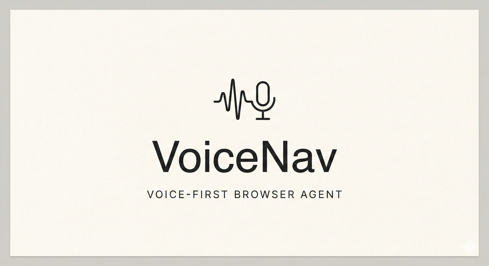
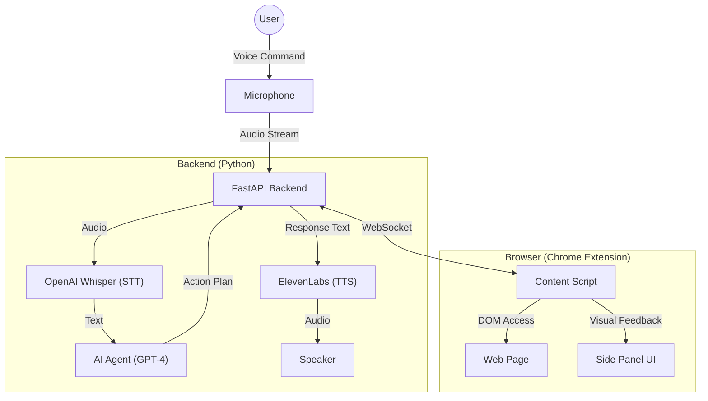

# 🎙️ VoiceNav - A Voice-First AI Browser Agent

> **MIT Global AI Hackathon 2026 | Mozilla "Bring Your Own AI to Every Website" Track**



[](https://www.python.org/downloads/)
[](https://reactjs.org/)

**VoiceNav** transforms your browsing experience by turning natural language voice commands into executing actions. It's not just a voice search; it's an **autonomous agent** that can navigate, click, type, and read web pages for you.

---

## 🚀 Key Features

- **🗣️ True Voice Control**: Speak naturally. "Find me cheap tickets to London" instead of typing keywords.
- **🤖 Autonomous Navigation**: The agent understands page structure. It can click buttons, fill forms, and navigate complex flows (like flight search) on its own.
- **🧠 Context-Aware Intelligence**: It reads the page you're on. Ask "How much is this?" or "Who is the author?" and it answers based on visible content.
- **💬 Persistent Conversation**: Remembers your previous queries and the context of the conversation.
- **🔒 Privacy-First**: Explicit permission model. You decide when the agent can **Read**, **Navigate**, or **Interact**.

---

## 🏗️ Architecture

VoiceNav uses a hybrid architecture with a local Chrome Extension for DOM interaction and a powerful Python backend for intelligence.



## 🛠️ Tech Stack

- **Backend**: Python, FastAPI, OpenAI (Whisper + GPT-4), ElevenLabs API
- **Frontend**: TypeScript, React, Vite, Tailwind CSS
- **Communication**: Real-time WebSocket
- **Browser Integration**: Mozilla Web Agent SDK concepts

---

## ⚡ Quick Start

### Prerequisites
- Python 3.11+
- Node.js 18+
- Google Chrome
- API Keys: `OPENAI_API_KEY`, `ELEVENLABS_API_KEY`

### 1-Click Setup (Mac/Linux)
```bash
git clone https://github.com/fp/VoiceBrowser.git
cd VoiceBrowser/voicenav
chmod +x setup.sh
./setup.sh
```

### Manual Setup

#### 1. Backend
```bash
cd backend
python3 -m venv venv
source venv/bin/activate
pip install -r requirements.txt
cp .env.example .env  # Add your API keys here
uvicorn main:app --reload
```

#### 2. Extension
```bash
cd extension
npm install
npm run build
# Load 'extension/dist' as an unpacked extension in Chrome
```

---

## 🎮 Demo Scenarios to Try

1.  **Flight Search (Complex Interaction)**
    > *"Go to Skyscanner and find me flights from New York to London in May."*
    > (Watch it fill forms, pick dates, and search)

2.  **Information Retrieval (Context Aware)**
    > *"Go to Wikipedia and search for Alan Turing. When was he born?"*
    > (It navigates, verifies the page, and extracts the specific answer)

3.  **Media Control (DOM Interaction)**
    > *"Go to YouTube and play some Jazz music."*
    > (It finds the search bar, types, and clicks the first video)

---

## 🛡️ Permission Model

We believe in **Human-in-the-loop** AI.
- **READ**: Auto-granted for page analysis.
- **NAVIGATE**: Requires one-time confirmation per session.
- **INTERACT**: (Input/Click) Requires explicit confirmation for critical actions.

---

## 🔮 Future Roadmap

- [ ] **Mobile Support**: Porting the extension to mobile browsers.
- [x] **Vision Capabilities**: Integrating GPT-4o for visual understanding of the page layout.
- [ ] **Local LLM Support**: Running local hosted LLMs for privacy-focused users.
